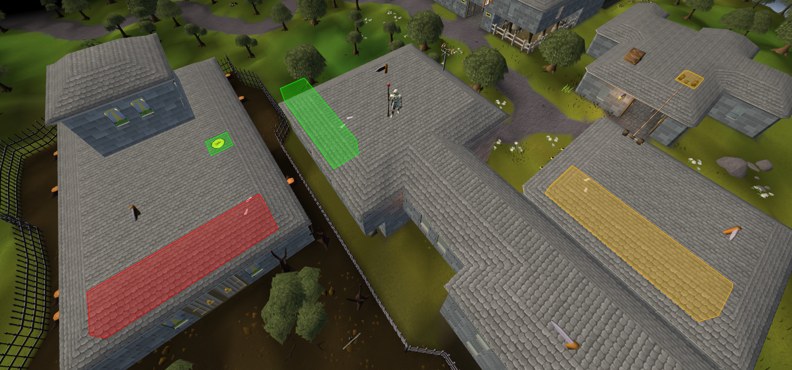
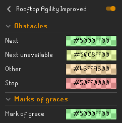

# Rooftop Agility Improved - v0.5.3
Improved clickboxes for rooftop agility courses.

 

## Features
* Shows all rooftop obstacles clickboxes. Even the ones that are not on the same level as player.
* Shows which obstacle is the next one.
* Shows unavailable obstacles and when player should click on next obstacle.
* Shows which obstacle should not be used before picking up Mark of grace.
* Highlights Mark of graces.

 

## Implemented rooftops
- [x] Draynor
- [x] Al Kharid
- [x] Varrock
- [x] Canifis
- [x] Falador
- [x] Seers
- [x] Pollnivneach
- [x] Rellekka
- [x] Ardougne

 

## Config

